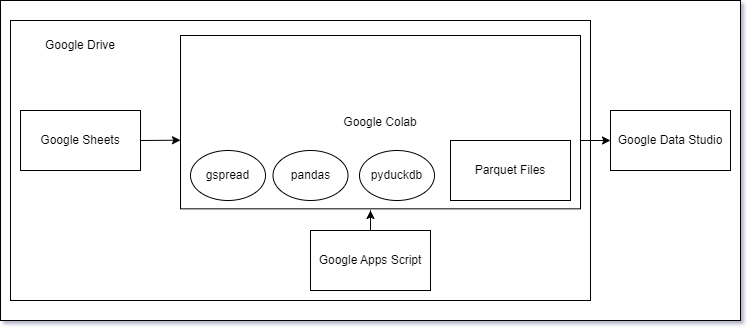

# Sheets2DuckDB

## Google Sheets para DuckDB com Google Colab e Visualizações no Google Data Studio

Este projeto demonstra um pipeline de processamento de dados que extrai informações de uma planilha do Google Sheets, utiliza o Google Colab para ingerir, transformar os dados com as bibliotecas gspread, pandas e pyduckdb, converte os dados em arquivos Parquet e armazena-os no Google Drive. Em seguida, esses dados são lidos pelo DuckDB para análises e, por fim, são criadas visualizações interativas no Google Data Studio. Além disso, o pipeline é automatizado com o Google Apps Script para acionar o processamento diário.

## Objetivo

O objetivo deste projeto é criar um fluxo automatizado para processar, transformar, armazenar e analisar dados de uma planilha do Google Sheets, utilizando ferramentas do ecossistema Google e compartilhando os resultados por meio de visualizações interativas.



## Fluxo do Pipeline

1. **Extração de Dados do Google Sheets:**
   - Utiliza a biblioteca gspread para extrair os dados da planilha do Google Sheets.

2. **Transformação com o Google Colab:**
   - Um notebook do Google Colab é usado para realizar transformações nos dados extraídos.
   - A biblioteca pandas é utilizada para a manipulação e limpeza dos dados.
   - A biblioteca pyduckdb é utilizada para interagir com o DuckDB e executar transformações SQL.

3. **Conversão para Parquet e Armazenamento no Google Drive:**
   - Os dados transformados são convertidos em arquivos Parquet usando o pandas.
   - O Google Drive é utilizado para armazenar os arquivos Parquet.

4. **Leitura pelo DuckDB:**
   - O DuckDB se conecta aos arquivos Parquet no Google Drive para realizar consultas analíticas.

5. **Criação de Visualizações com o Google Data Studio:**
   - O DuckDB é conectado ao Google Data Studio para criar visualizações interativas e painéis de análise.

6. **Automação com Google Apps Script:**
   - O Google Apps Script é usado para agendar e acionar o pipeline de processamento diariamente, processando os dados de D-1.

## Configuração e Uso

1. Instale as dependências necessárias no ambiente do Google Colab:
   ```bash
   # Instale a biblioteca gspread
   !pip install gspread
   
   # Instale a biblioteca pandas
   !pip install pandas
   
   # Instale a biblioteca pyduckdb
   !pip install pyduckdb

1. **Execução do Notebook do Google Colab (`data_processing_pipeline.ipynb`):**
   - Siga as instruções no notebook para autenticar-se com a API do Google Sheets e implementar as etapas de extração, transformação e armazenamento no Google Drive.

2. **Configuração do Google Data Studio:**
   - Acesse o Google Data Studio e crie um novo relatório.
   - Conecte-se ao DuckDB como fonte de dados.
   - Crie visualizações interativas utilizando os dados armazenados.

3. **Configuração do Google Apps Script:**
   - Crie um projeto no Google Apps Script.
   - Implemente um script para acionar o pipeline diariamente, utilizando um gatilho de tempo.

## Estrutura do Projeto

- `notebooks/`: Contém o notebook do Google Colab (`data_processing_pipeline.ipynb`) com o código de extração, transformação e armazenamento.
- `data/`: Armazena arquivos CSV de exemplo ou intermediários (se necessário).
- `docs/`: Documentação do projeto, capturas de tela e outros recursos.

## Resultados

- Dados transformados armazenados em arquivos Parquet no Google Drive.
- Visualizações interativas criadas no Google Data Studio.

## Recursos Adicionais

- [Documentação do Google Sheets API](https://developers.google.com/sheets/api)
- [Documentação do gspread](https://gspread.readthedocs.io/en/latest/)
- [Documentação do pandas](https://pandas.pydata.org/docs/)
- [Documentação do DuckDB](https://duckdb.org/docs)
- [Google Data Studio](https://datastudio.google.com/)
- [Google Apps Script](https://developers.google.com/apps-script)

## Contribuição

Contribuições são bem-vindas! Se você encontrar problemas ou quiser melhorar este pipeline, sinta-se à vontade para enviar um pull request.
