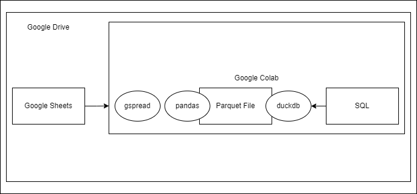

# Sheets2DuckDB

## Google Sheets, DataFrame com Pandas, arquivo Parquet e tabela no DuckDB com Google Colab

Este projeto demonstra um pipeline de que extrai informações de uma planilha do Google Sheets utilizando a biblioteca gspread, transforma e converte os dados em arquivo Parquet com pandas, armazena-o no Google Drive, cria um banco de dados DuckDB e uma tabela a partir do arquivo Parquet com duckdb.

## Objetivo

O objetivo deste projeto é demonstrar um fluxo para processar, transformar e armazenar utilizando ferramentas gratuitas do ecossistema Google.

## Diagrama do Pipeline

## Fluxo do Pipeline

1. **Extração de Dados do Google Sheets:**
   - Utiliza a biblioteca gspread para extrair os dados da planilha do Google Sheets.

2. **Transformação com o Google Colab:**
   - A biblioteca pandas é utilizada para a manipulação e limpeza dos dados.

3. **Conversão para Parquet e Armazenamento no Google Drive:**
   - Os dados transformados são convertidos em arquivo Parquet usando o pandas.
   - O Google Drive é utilizado para armazenar o arquivo Parquet.

4. **Leitura pelo DuckDB:**
   - O DuckDB cria uma tabela a partir do arquivo Parquet do Google Drive para executar transformações SQL.

## Configuração e Uso

1. **Execução do Notebook do Google Colab (`Sheets2DuckDB.ipynb`):**
   - Siga as instruções no notebook para autenticar-se com a API do Google Sheets e implementar as etapas de extração, transformação e armazenamento no Google Drive.

## Estrutura do Projeto

- `notebook/`: Contém o notebook do Google Colab (`Sheets2DuckDB.ipynb`) com o código de extração, transformação e armazenamento.
- `doc/`: Diagrama do pipeline.

## Resultados

- Dados do Google Sheet transformados com Pandas e armazenado em arquivo Parquet no Google Drive.
- Tabela no DuckDB a partir do arquivo Parquet para aplicar consultas SQL.

## Recursos Adicionais

- [Documentação do gspread](https://gspread.readthedocs.io/en/latest/)
- [Documentação do pandas](https://pandas.pydata.org/docs/)
- [Documentação do DuckDB](https://duckdb.org/docs)
